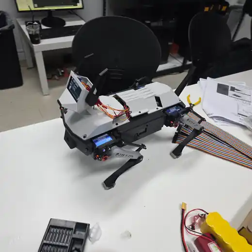
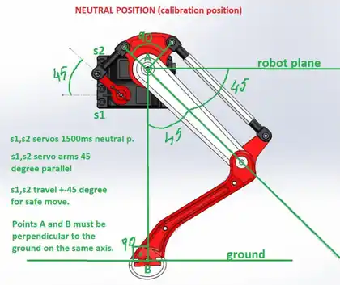
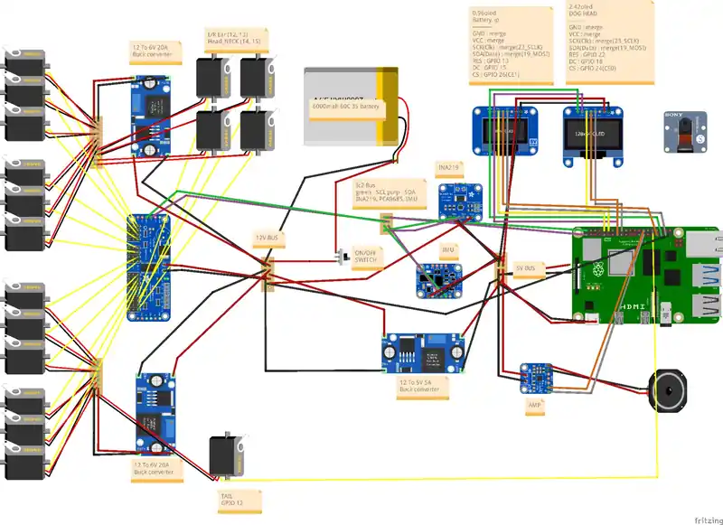

# Quadruped Robot Dog

🌐 **언어:** [English](README.md) | **한국어**

> **프로젝트 상태: 일시 중단 / 경량화 재설계 예정**

<p align="center">
  
  <br>
  <sub>보행 중심 재설계 이전의 Version 1 프로토타입</sub>
</p>

개인적으로 제작하고 있는 4족 보행 로봇 프로젝트입니다.

초기 버전은 단순한 보행 로봇이 아니라 머리, 귀, 꼬리, 디스플레이, 카메라, 스피커, 센서 등을 포함한 비교적 많은 기능을 가진 로봇개를 목표로 설계했습니다. 실제로 대부분의 기구 구조를 제작했고, 각 모터와 주변 장치도 개별적으로 테스트했습니다.

하지만 전체 시스템을 통합하는 과정에서 **안정적인 보행을 만들기 전에 부가 기능을 너무 많이 추가했다는 문제**가 드러났습니다.

머리와 부가기구 때문에 전체 무게가 예상보다 증가했고, 무게중심도 불리해졌으며, 동시에 제어해야 하는 장치가 많아지면서 시스템 복잡도 역시 크게 증가했습니다.

그래서 현재 프로젝트는 잠시 중단한 상태이며, 다음 버전에서는 목표를 하나로 줄일 예정입니다.

> **우선 제대로 서고, 제대로 걷는 4족 보행 플랫폼을 만든다. 나머지는 그 이후에 추가한다.**

---

## 프로젝트 목표

장기적으로는 이 플랫폼을 이용해 다음 내용을 공부하는 것이 목표입니다.

- 다리 기구학
- Servo 제어
- Gait Generation
- IMU 기반 자세 안정화
- ROS 2 통합
- Simulation 및 Sim2Real

다음 버전은 기존 V1보다 의도적으로 단순하게 만들 예정입니다.

처음부터 완성형 로봇개를 만들기보다, 먼저 **12-DOF 보행 플랫폼 자체를 안정적으로 동작시키는 것**에 집중합니다.

---

## Version 1 프로토타입

첫 번째 버전은 상당히 많은 기능을 포함한 상태로 실제 제작까지 진행했습니다.

### 구동부

- 다리용 Servo 12개
- 머리 Servo 2개
- 귀 Servo 2개
- 꼬리 Servo 1개
- **총 17개의 Servo**

### 전자부품 및 주변장치

- Raspberry Pi 5
- PCA9685 Servo Controller
- IMU
- 배터리 상태 측정
- OLED Display
- Camera
- Speaker / Amplifier
- DC-DC Buck Converter
- Battery / Power Distribution System

다리 구조는 링크 메커니즘을 사용했으며, Servo Neutral Position과 각 관절의 초기 각도를 맞추는 Calibration이 중요했습니다.

<p align="center">
  
  <br>
  <sub>Version 1에서 사용한 Servo Neutral Position / Linkage Calibration Reference</sub>
</p>

기구 설계, 내부 배선, 회로 구성도 역시 V1 제작 과정에서 직접 구성하고 수정했습니다.

### Version 1 회로 및 배선

<p align="center">
  
  <br>
  <sub>Version 1 회로 및 배선도 — 초기의 기능 중심 구조를 기록하기 위해 보관합니다.</sub>
</p>

다음 버전에서는 보행에 필요하지 않은 장치를 제거하고 전원 분배와 배선도 더 단순하게 다시 구성할 예정입니다.

---

## Version 1을 중단한 이유

V1을 만들면서 가장 크게 배운 점은 **개별 기능이 각각 작동한다고 해서 전체 로봇이 잘 작동하는 것은 아니라는 것**이었습니다.

특히 다음 문제가 컸습니다.

### 1. 전체 무게 증가

머리 구조, 귀 Servo, 꼬리, Speaker, OLED, Camera, 추가 프레임, 배선 및 여러 전자부품을 넣으면서 전체 질량이 상당히 증가했습니다.

그 결과 다리 Servo가 감당해야 하는 부하가 커졌고, 안정적인 보행을 위한 여유가 줄어들었습니다.

### 2. 불리한 무게중심

상부 구조물이 커지면서 다리 프레임보다 높은 위치에 질량이 집중되었습니다.

이는 보행 중 자세를 유지하기 어렵게 만들고, 작은 자세 변화에도 몸체가 쉽게 흔들리는 원인이 될 수 있었습니다.

### 3. 너무 높은 시스템 복잡도

한 번에 다음 기능들을 모두 구현하려고 했습니다.

- 보행
- 머리 움직임
- 귀 움직임
- 꼬리 움직임
- OLED
- Speaker
- Camera
- Sensor
- Battery Monitoring
- Power Management

첫 4족 보행 프로젝트에서 동시에 디버깅해야 할 변수가 너무 많았습니다.

### 4. 핵심인 보행이 충분히 완성되지 않음

각 Servo와 여러 주변 장치는 개별적으로 테스트할 수 있었지만, 안정적인 Standing과 Walking은 아직 완성하지 못했습니다.

4족 보행 로봇에서 가장 중요한 기능은 결국 **안정적으로 서고 걷는 것**이기 때문에, 부가기능을 더 추가하는 것은 프로젝트를 오히려 어렵게 만든다고 판단했습니다.

---

## 재설계 방향

다음 버전에서는 **Locomotion-First Architecture**로 변경할 계획입니다.

주요 변경 방향은 다음과 같습니다.

- 머리 구조 제거
- 귀 메커니즘 제거
- 꼬리 제거
- Speaker 제거
- 필수적이지 않은 OLED 및 장식용 전자부품 제거
- 내부 배선 단순화
- 전체 프레임 경량화
- 무게중심 낮추기
- 보행 및 자세 추정에 필요한 부품만 유지
- 12-DOF 다리 제어에 집중
- Walking보다 Standing을 먼저 완성
- 빠른 보행보다 느리고 안정적인 Gait를 먼저 구현

부가기능은 기본 플랫폼의 보행이 충분히 안정화된 이후 필요할 경우 다시 추가할 예정입니다.

---

## 예정 핵심 하드웨어

다음 버전에서는 대략 다음 구성만 유지할 계획입니다.

| 분류 | 예정 구성 |
| --- | --- |
| Main Computer | Raspberry Pi 5 16GB |
| Operating System | Ubuntu 24.04 LTS |
| ROS | ROS 2 Jazzy |
| Leg Actuation | Servo Motor × 12 |
| Servo Control | PCA9685 기반 Servo 제어 |
| State Estimation | IMU |
| Power | Battery + DC-DC Regulation |
| Mechanical Structure | 12-DOF Quadruped Frame |

세부 구성은 재설계 과정에서 변경될 수 있습니다.

---

## Software Architecture

기존처럼 각 하드웨어를 개별 테스트 코드로만 운용하는 대신, 이후에는 ROS 2 기반으로 기능을 분리할 계획입니다.

예상 구조는 다음과 같습니다.

```text
ROS 2
│
├── servo_driver_node
│     └── 다리 Servo 명령
│
├── imu_node
│     └── 자세 / 가속도 데이터 Publish
│
├── gait_controller_node
│     └── 다리 궤적 생성
│
├── state_estimator_node
│     └── Robot Body State 추정
│
└── high_level_controller
      └── Standing / Walking Command
```

아직 최종 구조는 아니며, 실제 통합 과정에서 변경될 수 있습니다.

---

## 개발 순서

이번에는 기능을 한 번에 추가하지 않고 단계별로 진행할 예정입니다.

### Stage 1 — 기구 경량화

- 불필요한 부가기구 제거
- 전체 질량 감소
- 관절 간섭 확인
- Servo 전체 재 Calibration

### Stage 2 — 기본 관절 제어

- 각 관절 독립 제어
- 회전 방향 확인
- Neutral Pose 정의
- Safe Joint Limit 설정

### Stage 3 — Standing

- Forward / Inverse Kinematics 구현
- 네 발의 목표 위치 제어
- 정적인 Standing 안정화

### Stage 4 — Walking

- 느린 Crawl Gait부터 구현
- Step Height / Stride Length / Timing 튜닝
- 안정화 이후 Trot Gait 적용

### Stage 5 — Feedback Control

- IMU Feedback 적용
- Body Roll / Pitch 보정
- 보행 중 자세 안정성 향상

### Stage 6 — Simulation / Sim2Real

실물 로봇의 기구 구조와 Joint 정의가 충분히 안정화된 이후 Simulation Model을 만들고, 강화학습 및 Sim2Real도 시도할 계획입니다.

---

## 현재 상태

| 항목 | 상태 |
| --- | --- |
| V1 기구 프로토타입 | ✅ 제작 완료 |
| 12-DOF 다리 구조 | ✅ 제작 완료 |
| 머리 / 귀 / 꼬리 | ✅ V1에서 제작 |
| 개별 Servo 테스트 | ✅ 완료 |
| Sensor / 주변장치 테스트 | ✅ 일부 완료 |
| 전체 ROS 2 통합 | ⏸️ 중단 |
| 안정적인 Standing | ⏳ 예정 |
| 안정적인 Walking | ⏳ 예정 |
| 경량 V2 재설계 | ⏳ 예정 |
| Simulation Model | ⏳ 예정 |
| Sim2Real | ⏳ 장기 목표 |

---

## 보관 중인 Version 1 자료

V1 제작 과정에서 사용했던 자료들을 보관하고 있습니다.

- Fusion 360 전체 Assembly
- Fritzing 회로 설계 파일
- Wiring Diagram
- Servo Calibration Reference
- 제작 과정 사진

이 자료들은 **Version 1 구조를 기준으로 작성된 자료**이기 때문에 향후 경량화된 V2와는 구조가 달라질 수 있습니다.

프로젝트를 다시 진행하게 되면 필요한 자료를 정리한 뒤 저장소에 순차적으로 추가할 예정입니다.

---

## 프로젝트 메모

현재 이 저장소는 완성된 프로젝트가 아니라 **진행 중 중단된 개발 기록**입니다.

V1의 문제점도 일부러 남겨두려고 합니다.

이후의 재설계 방향이 바로 이 문제들에서 나온 것이기 때문입니다.

V1에서 얻은 가장 큰 교훈은 단순했습니다.

> **로봇개처럼 보이게 만드는 것보다 먼저 제대로 서고 걷게 만들어야 한다.**

다음 버전에서는 기능을 줄이는 대신 더 가볍고, 더 단순하고, 더 디버깅하기 쉬우며, 무엇보다 보행 자체에 집중된 구조를 목표로 합니다.

---

## Roadmap

- [x] 첫 기구 프로토타입 제작
- [x] 12-DOF 다리 시스템 조립
- [x] 머리 / 귀 / 꼬리 제작
- [x] 개별 Actuator 및 주변장치 테스트
- [ ] V1 불필요 하드웨어 제거
- [ ] 전체 경량화
- [ ] 모든 관절 재 Calibration
- [ ] ROS 2 Hardware Interface 정리
- [ ] Standing Controller 구현
- [ ] Crawl Gait 구현
- [ ] Trot Gait 구현
- [ ] IMU 기반 자세 안정화
- [ ] Simulation Model 제작
- [ ] Sim2Real 시도

---

## License / Credits

현재 저장소는 개인 개발 기록 형태로 운영하고 있습니다.

향후 프로젝트를 재현 가능한 형태로 정리해 공개할 때 사용한 외부 설계, 라이브러리, 참고 자료의 Credits와 License도 함께 정리할 예정입니다.
